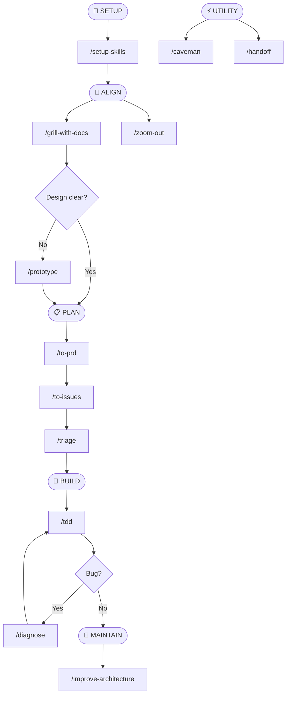

# Skill Architecture Visualization Spec

This document defines a generic workflow for analyzing all skills in this repo and generating a Mermaid diagram that shows how they fit together.

The goal is to:
- Discover skills and their metadata.
- Group them into phases or categories.
- Infer common flows between skills (setup → align → plan → build → maintain).
- Output a readable Mermaid diagram that can be embedded into markdown or HTML.

---

## 1. Inputs

The agent should use the following inputs:

- The current repository’s directory structure.
- Any `SKILL.md` files under known skill roots, for example:
  - `.claude/skills/**/SKILL.md`
  - `skills/**/SKILL.md`
- Any existing docs that describe workflows or categories, for example:
  - `README.md`, `CONTEXT.md`, `docs/**`, `*.md` in the repo root.

If these paths do not exist, the agent should:
- List the top-level directories.
- Ask the user which directory contains skills (or skip if none).

---

## 2. Discovery Process

1. **Locate skill files**
   - Recursively search for files named `SKILL.md`.
   - For each match, capture:
     - Skill directory name.
     - Relative path.
     - Contents of `SKILL.md`.

2. **Extract metadata**
   For each `SKILL.md`:
   - Read frontmatter (if present) for:
     - `name`
     - `description`
   - Scan the body for:
     - “Use when” or “Use this when” sentences.
     - References to other skills (e.g., `/other-skill`, “then run `/X`”).
     - Words that indicate phase, such as:
       - setup / install / configure
       - align / design / grill / interview
       - plan / PRD / issues / triage
       - build / implement / TDD / tests
       - maintain / refactor / architecture / cleanup / migrate

3. **Build an internal model**
   For each skill, store:
   - `id`: a simple short name (directory or frontmatter `name`).
   - `label`: human-readable label for display.
   - `description`: 1–2 line summary.
   - `phase`: inferred category (see below).
   - `edges`: list of outgoing links to other skills (dependencies or typical follow-ups).

---

## 3. Phase Categorization

Map each skill into **one primary phase** based on its purpose:

- `setup`
  - Installs or configures other skills.
  - Defines repo-wide config, hooks, or scaffolding.

- `align`
  - Gathers requirements, grills user, builds shared language or context.
  - Includes any “grill”, “interview”, or “shared vocabulary” workflows.

- `plan`
  - Creates PRDs, tickets, or planning documents.
  - Breaks work into issues, vertical slices, or triage flows.

- `build`
  - Implements features or fixes.
  - Includes TDD, coding loops, and debugging loops.

- `maintain`
  - Improves architecture, refactors, migrates, or cleans up.
  - Long-term health of the codebase.

- `utility`
  - Can be used at any time.
  - Communication compression, handoff docs, helpers, or meta-skills (like `write-a-skill`).

If a skill seems to belong to multiple phases, pick the **primary** one based on:
- What the skill does most of the time.
- Where it usually appears in example workflows.

---

## 4. Flow Extraction

Derive edges between skills based on:

- Explicit instructions in `SKILL.md`:
  - “Run `/X` after this.”
  - “Use `/Y` for debugging when tests fail.”
- Implicit relationships:
  - Setup skills that mention other skills.
  - Planning skills that produce artifacts consumed by other skills.
  - Maintenance skills that refer back to earlier phases.

When in doubt:
- Prefer simple, linear flows over complex graphs.
- Only create an edge if there is a clear “this skill tends to lead to that skill” relationship.

Example flows:
- `setup` → `align`
- `align` → `plan`
- `plan` → `build`
- `build` → `maintain`
- `build` → `build` (loops, e.g. TDD + diagnose)
- `utility` → any phase, but usually drawn as a separate island.

---

## 5. Mermaid Diagram Requirements

Generate a single Mermaid `flowchart` that:

- Shows **phase nodes** and **skill nodes**.
- Groups skills visually by phase.
- Shows typical directional flow for a single change.

### 5.1. Diagram type

Use:

```mermaid
flowchart TD
```

Top-to-bottom orientation, with phases roughly ordered:

1. Setup
2. Align
3. Plan
4. Build
5. Maintain
6. Utility (off to the side)

### 5.2. Node conventions

- Phase nodes:
  - Style: larger, darker boxes or labels like `["📐 ALIGN"]`.
- Skill nodes:
  - One per skill, named with the slash prefix (e.g. `/grill-with-docs`).
  - Include a short 1–2 line hint.

Example node:

```mermaid
B0(["📐 ALIGN"]):::phase
B["/grill-with-docs<br/>Grill user, update context"]:::align
```

### 5.3. Edges

- Connect phases in the main flow:
  - `setup` → `align` → `plan` → `build` → `maintain`.
- Connect skills to their phase’s label node.
- Connect skills to other skills for important flows.

Example:

```mermaid
A0(["🚀 SETUP"]):::phase --> A["/setup-skills<br/>Run once per repo"]:::setup
A --> B0(["📐 ALIGN"]):::phase
B0 --> B["/grill<br/>Requirements interview"]:::align
```

### 5.4. Styles

Define classDefs at the bottom:

```mermaid
classDef phase fill:#0f172a,stroke:#1f2937,color:#e5e7eb,font-weight:bold,rx:6,ry:6;
classDef setup fill:#7c3aed,stroke:#5b21b6,color:#ffffff,rx:6,ry:6;
classDef align fill:#4f46e5,stroke:#3730a3,color:#ffffff,rx:6,ry:6;
classDef plan fill:#0369a1,stroke:#075985,color:#ffffff,rx:6,ry:6;
classDef build fill:#b45309,stroke:#92400e,color:#ffffff,rx:6,ry:6;
classDef maintain fill:#15803d,stroke:#166534,color:#ffffff,rx:6,ry:6;
classDef utility fill:#374151,stroke:#4b5563,color:#f3f4f6,rx:6,ry:6;
classDef decision fill:#1f2937,stroke:#4b5563,color:#e5e7eb,rx:4,ry:4;
```

Agents should:
- Keep node text concise.
- Avoid crossing lines where possible.
- Limit to ~15 skills per diagram, or split into multiple diagrams if there are many.

---

## 6. Output Formats

The agent should produce:

1. **Markdown snippet** with Mermaid code  
   For example:

   ```markdown
   ```mermaid
   flowchart TD
     ...
   ```
   ```

2. **Optional HTML wrapper**  
   - A standalone HTML file that:
     - Loads Mermaid via CDN.
     - Calls `mermaid.initialize({ startOnLoad: true, theme: "dark" })`.
     - Embeds the same Mermaid `flowchart` string inside a `<div class="mermaid">`.

---

## 7. Validation Checklist

Before finishing, the agent should verify:

- Every discovered skill appears in at least one diagram, or is explicitly skipped with a note.
- Each skill has:
  - Phase.
  - Short description.
- The main flow is:
  - `setup` → `align` → `plan` → `build` → `maintain`.
- Utility skills are clearly marked and not in the main line.
- Mermaid syntax validates and renders in a basic Mermaid playground.

---

## 8. Example Flow (Pseudo)

Do not hardcode these nodes, but use this structure as a template:



The agent should adapt this skeleton to the actual skills in the repo.

---

## 9. Usage

When you want a diagram:

- Ask the agent:  
  “Use `Skill Architecture Visualization Spec` to scan this repo’s skills and produce a Mermaid diagram of how they work together.”
- Paste the generated Mermaid into:
  - `docs/skills-architecture.md`, or
  - an HTML wrapper for live preview.