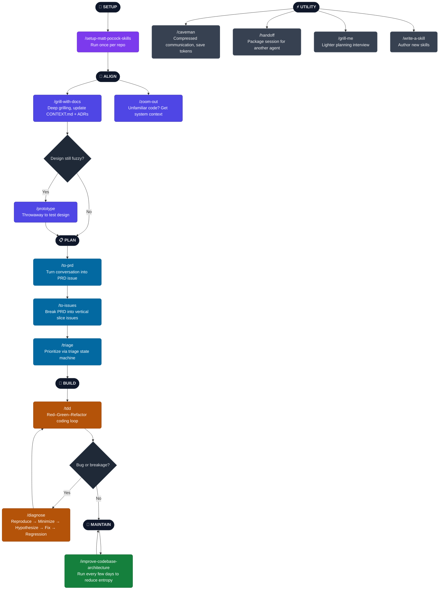

# mattpocock/skills Cheatsheet

This summarizes how to use the core skills from `mattpocock/skills` in a typical engineering workflow: setup once per repo, then align → plan → build → maintain, with utility skills available anytime [cite:2].

---

## 🟣 Step 0 — One-Time Setup (Per Repo)

| Skill | Purpose |
| --- | --- |
| `/setup-matt-pocock-skills` | Scaffold per-repo config: issue tracker choice, triage label vocabulary, and doc layout (CONTEXT.md, ADRs). Run this once per repo before using `to-issues`, `to-prd`, `triage`, `diagnose`, `tdd`, `improve-codebase-architecture`, or `zoom-out` [cite:2]. |

---

## 🔵 Phase 1 — Align (Before Every Feature)

Use these when you are about to make a change and want to make sure you and the agent are on the same page [cite:2].

| Skill | When to Use |
| --- | --- |
| `/grill-with-docs` | First step for any non-trivial change. Agent grills you on the plan, sharpens terminology, and updates CONTEXT.md and ADRs so you share a concise domain language [cite:2]. |
| `/zoom-out` | When you are looking at unfamiliar code or a subsystem and need a higher-level explanation that connects it to the rest of the system [cite:2]. |
| `/prototype` | When the design is still fuzzy. Build a throwaway prototype (CLI or UI variants) to explore design options before committing to a full implementation [cite:2]. |

---

## 🟦 Phase 2 — Plan

Once you are aligned on what to build, use these to structure the work into issues and PRDs [cite:2].

| Skill | When to Use |
| --- | --- |
| `/to-prd` | Turn the current conversation context into a PRD and submit it as a GitHub issue, without another interview step [cite:2]. |
| `/to-issues` | Break a PRD, plan, or spec into independently-grabbable GitHub issues using vertical slice work units [cite:2]. |
| `/triage` | Triage and prioritize issues using a state machine of triage roles and labels that you configured during setup [cite:2]. |

---

## 🟠 Phase 3 — Build

These are for doing the actual implementation and debugging [cite:2].

| Skill | When to Use |
| --- | --- |
| `/tdd` | Main coding loop. Use for test-driven development: write a failing test, make it pass, then refactor, one vertical slice at a time [cite:2]. |
| `/diagnose` | When you hit a hard bug or performance regression. Follows a disciplined loop: reproduce → minimize → hypothesize → instrument → fix → regression-test [cite:2]. |

---

## 🟢 Ongoing — Maintenance

Use these regularly to prevent the codebase turning into a ball of mud [cite:2].

| Skill | When to Use |
| --- | --- |
| `/improve-codebase-architecture` | Run this once every few days or when the codebase feels messy. It searches for opportunities to deepen modules and improve design, guided by CONTEXT.md and ADRs [cite:2]. |

---

## ⚡ Utility — Use Anytime

These skills can be used across all phases and are not tied to the main setup → align → plan → build → maintain flow [cite:2].

| Skill | Purpose |
| --- | --- |
| `/caveman` | Ultra-compressed communication mode that drops filler while keeping technical accuracy, reducing token usage by around 75 percent [cite:2]. |
| `/handoff` | Compress the current conversation into a handoff document so another agent (or future you) can continue the work seamlessly [cite:2]. |
| `/grill-me` | Grilling session for non-code or general planning tasks, similar to `grill-with-docs` but without the engineering-document extras [cite:2]. |
| `/write-a-skill` | Create new skills with proper structure, progressive disclosure, and bundled resources, based on patterns used in this repo [web:14]. |

---

## Flow Summary

High level flow for a typical change using these skills [cite:2]:

```text
SETUP (once) → ALIGN → PLAN → BUILD → MAINTAIN
                    ↑          ↓
              (every change)   diagnose on bugs
```

